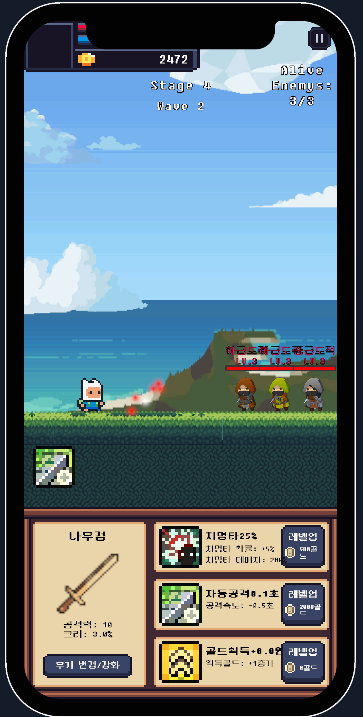

# 🗡️ 용사의 모험 - Auto Clicker Mobile Game

> Unity 기반 횡스크롤 오토클리커 게임  
> 🎮 제작 기간 중 팀 프로젝트로 개발된 교육용 게임입니다.

---

## 📌 프로젝트 정보

- **게임명**: 용사의 모험  
- **장르**: 횡스크롤 오토클리커 (모바일 타겟)  
- **플랫폼**: Android (모바일)  
- **Unity 버전**: Unity 2022 LTS  
- **언어**: C#  
- **버전 관리**: GitHub + Git LFS  
- **사용 툴**:  
  - Unity Editor  
  - Visual Studio  
  - Figma (UI 및 디자인 협업용)

---

## 🧩 게임 개요

플레이어는 스테이지 기반의 구조에서 등장하는 도적(에너미)을 쓰러트리고 다음 웨이브로 진행합니다.  
화면을 터치하여 수동 공격을 할 수 있고, 시간이 지나면 자동 공격도 병행됩니다.

### 🎮 주요 기능

- **터치 기반 수동 공격**  
- **시간 기반 자동 공격**  
- **에너미 웨이브 시스템**  
- **다양한 능력치 시스템**  
  - 치명타 확률 및 배율  
  - 자동 공격 속도  
  - 골드 획득량 증가  
- **아이템 인벤토리 시스템**  
- **Wave 클리어 시 JSON 기반 저장 기능**

---

## 👥 팀원 구성

| 역할 | 이름 | 담당 기능 |
|------|------|-----------|
| 팀장 | 유상원 | 무기 및 업그레이드, 깃 버전 관리 |
| 팀원 | 서정원 | 적 구현 및 스테이지 구성 |
| 팀원 | 유재훈 | 클릭 이벤트 처리 |
| 팀원 | 김주빈 | 플레이어 능력치 및 업그레이드 |
| 팀원 | 차우진 | 게임 매니저, 전체 흐름 관리 |

---

## 🖼️ 스크린샷

예시 스크린샷:

---
## 영상
예시 영상:

https://youtu.be/ta4qKzMzYfU
---

## 📜 라이선스

본 프로젝트는 **교육용 목적으로 제작**되었습니다.  
⛔ **무단 배포 및 상업적 이용을 금지**합니다.
